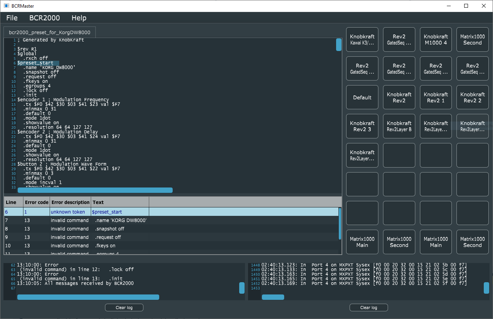

# Introduction

This is a little free software tool that allows you to program the Behringer BCR2000 MIDI controller in its native programming language called BCL.

Basically, the software provides the following features:

1. Load BCR configurations ("presets") from files in the raw "BCL" format, which is the programming language for the BCR 2000. There are several sources in the Internet on the programming language, a good start if you understand German would be this one: https://www.sequencer.de/synth/index.php/B-Control-Tokenreferenz
2. Load BCR configurations from MIDI sysex files, which is the normal exchange format for those presets. The tool will also show the source code in BCL of those files you got as .SYX files, so in case you want to modify them or understand how they work, this is really useful.
3. Send the loaded file directly to the BCR2000, no need to wrangle MIDI-ox
4. And the killer feature of this app (actually the reason why I wrote it) - if there is an error in your BCL file, it will actually show you in which line of code together with a proper error message from the device itself. 
5. You can retrieve the list of 32 presets that are currently stored in the BCR2000
6. and by clicking on one of the names, it will download the preset from the BCR2000 and show you the source code.
7. You can save any preset in BCL or SYX format, no matter if you got it from the device or from hard disk, so it makes a great converter tool as well.

This is how the UI looks like in action:

# Building the software

### Supported platforms

Tested currently only on Windows 10, but all technology used is cross platform and it should be possible to build on Linux and Mac OS, if you know what you are doing.

## Prerequisites

We use [CMake 3.14](https://cmake.org/) and Visual Studio 2017 for C++. Make sure to have both of these installed. Newer Visual Studios might work as well, you can select them as generators in CMake. For the exact sequence to build the software, checkout the github action files in the .github/workflows directory.

## Downloading

I provide a pre-built Windows binary in the release section of this github page.

## Building

Clone with submodules from github

    git clone --recurse-submodules https://github.com/christofmuc/BCR2000_Master.git

The recursive clone with  submodules is required to retrieve the following additional modules already into the right spot inside the source tree:

1. We use the magnificent [JUCE library](https://juce.com/) to immensly reduce the amount of work we have to do. 
6. [juce-cmake](https://github.com/remymuller/juce-cmake) to allow us to use JUCE and CMake together.
4. The configure step will download (on Windows) the allmighty [boost](https://www.boost.org/) library, sorry for the bloat but I simply had no time to remove the dependency yet. All my professional projects of course rely on boost, so it is a natural to incorporate it here as well.

## Building on Windows

Using CMake and building is a simple step if the prerequisites are fulfilled. Simply open a command line in the downloaded root directory `<PyTschirpDir>` and run

    cmake -S . -B builds -G "Visual Studio 16 2019" -A x64 -T v141 -DCMAKE_SYSTEM_VERSION=10.0.19041.0

This will generate a solution file for Visual Studio in the builds subdirectory. Sorry for the very picky version setup, but github as of 2023 has no VS2017 anymore, so we need to use 2019 and target the v14.1 toolset, which is VS 2017. The old JUCE library we still use here doesn't compile with newer compilers, and in addition Microsoft broke their newer SDKs with the old compiler, therefore we need to specify the exact Windows SDK version as well. Sigh.

You can build the software to run it immediately with the command

    cmake --build builds --config Release

This will produce the executable in the path `builds\source\Release`, namely a file called `BCRMaster.exe` which you can double click and launch.

## Licensing

As some substantial work has gone into the development of this, I decided to offer a dual license - AGPL, see the LICENSE.md file for the details, for everybody interested in how this works and willing to spend some time her- or himself on this, and a commercial MIT license available from me on request. Thus I can help the OpenSource community without blocking possible commercial applications.

## Contributing

All pull requests and issues welcome, I will try to get back to you as soon as I can. Due to the dual licensing please be aware that I will need to request transfer of copyright on accepting a PR. 

## About the author

Christof is a lifelong software developer having worked in various industries, and can't stop his programming hobby anyway. 
